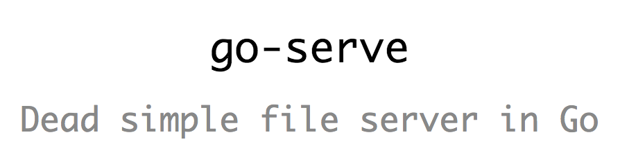

# go-serve
Quickly spin up a file server

## Install and usage:
[Download the binary from here](https://github.com/leninhasda/go-serve/releases/download/v0.1/go-serve)

Add executable permission and start using:
```
chmod +x go-serve
./go-serve
```

You can move the binary to `/usr/local/bin` and access globally:
```
sudo mv go-serve /usr/local/bin/
go-serve
```

> you can rename it to anything if you want

By default it will serve current directory port `5000`. But you can modify that:
```
go-serve -port 8080 // will serve current directory on port 8080
// or
go-serve -port 8080 -dir /Users/lenin // will serve home directory of lenin user on port 8080
```
